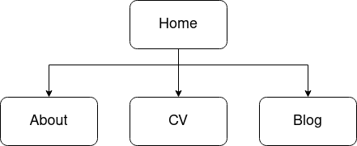

# Link to portfolio (to do)

# Link to github repo (to do)

## Purpose

This website was created to leverage online presence and as an example work for potential employers. It demonstrates my skills as a webdeveloper and describes my skilss, personality and work expirience.

## Features

## Sitemap

## Screenshots (to do)

## Target audience

This website is intended for web development employers

## Tech stack

- HTML
- CSS
- Netlify
