# [Portfolio website](https://glebtsoy.netlify.app/index.html)

## [Github repo](https://github.com/Gleebo/portfolio)

## Purpose

This website was created to leverage online presence and as an example work for potential employers. It demonstrates my skills as a webdeveloper and describes personality and work expirience.

## Features (to do)

#### Navigation

All of the pages are linked to one another with anchor `a` elments which are located in the `header` of the `body` and utilize `flex` layout.

#### Social links

The social links in `footer` of the `body` are functional hyperlinks that open respective social media page of the owner. The links were stylized using css `grid` layout.

#### Back to top link

A link with `position: fixed` located at the bottom left corner of each page that scrolls the webpage back to navigation menu at the top. It is semi-transparen unless hovered over to make it less distracting.

#### Hard Skills table

The table demonstrates hard skills of the developer and is stylized as a periodic table. To make table responsive it was made with `flex` layout with `wrap` property to automatically adjust to appopriate screen widths.

#### Download resume button (to do)

#### Blog posts

Blog post list was created with `flex` layout with `wrap` property and has media queires to make it easy to read on a various screen resolutions.

#### Home page

A landing page of the website that greets user and shortly idtroduces the developer and purpose of this website.

#### Resume page

The resume page contains a short version of the developer's resume and also has a button to download the full version in PDF format.

#### About me page

About me page introduces the developer's skills interests and personality.

#### Blog page

Blog page containts developer's blog posts on various topics.

## Sitemap

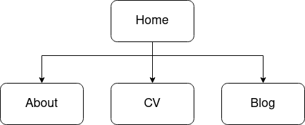

Sitemap

## Screenshots

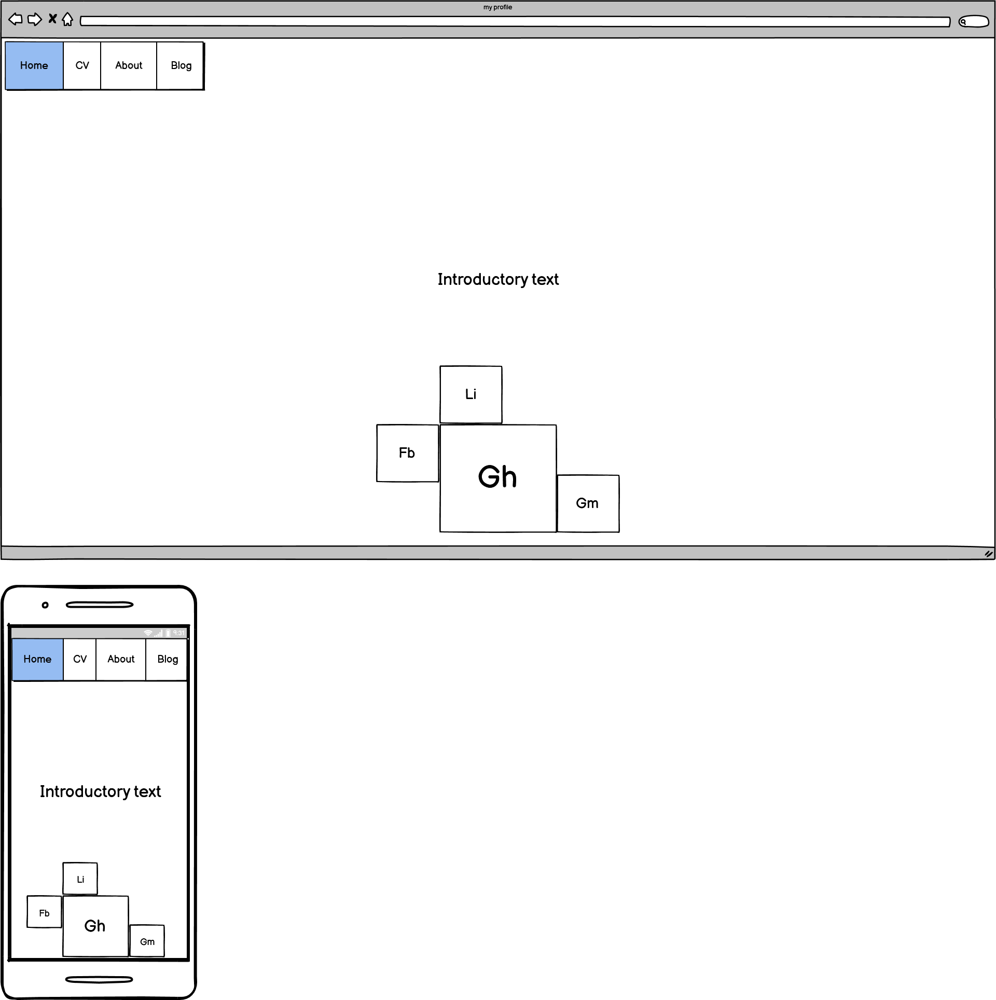

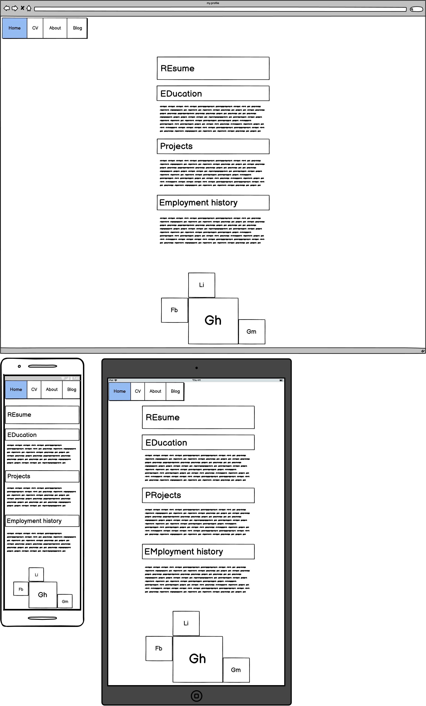

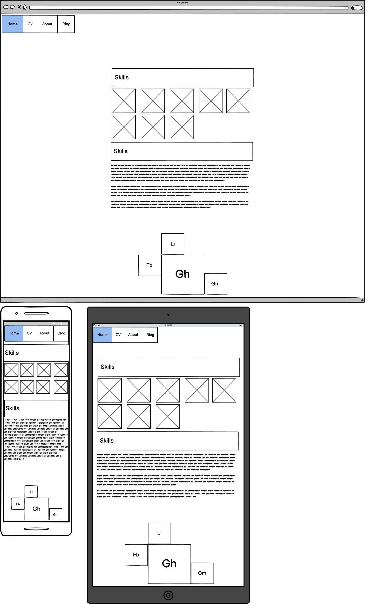

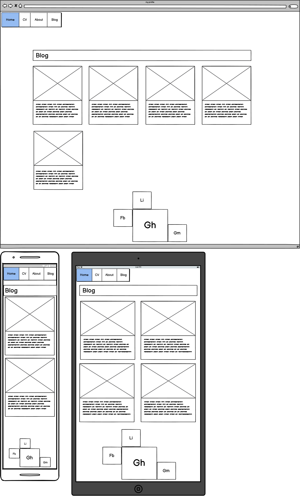

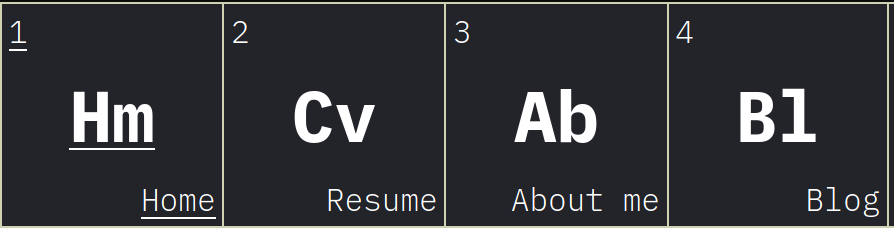

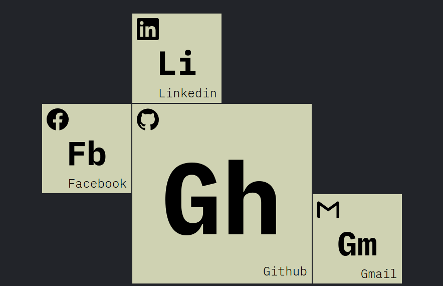

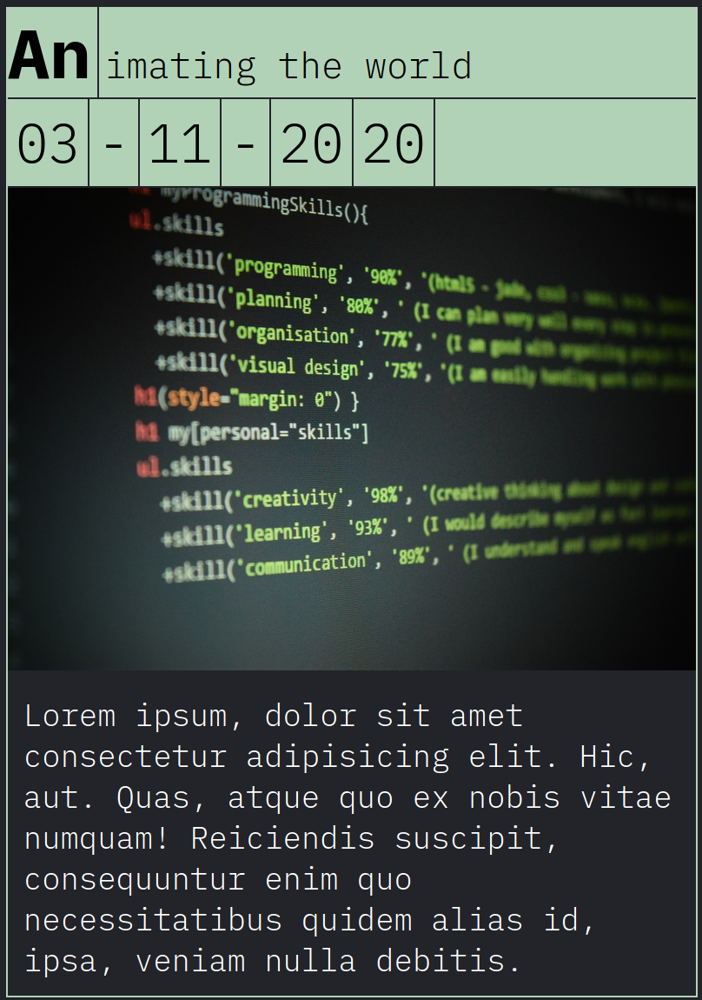

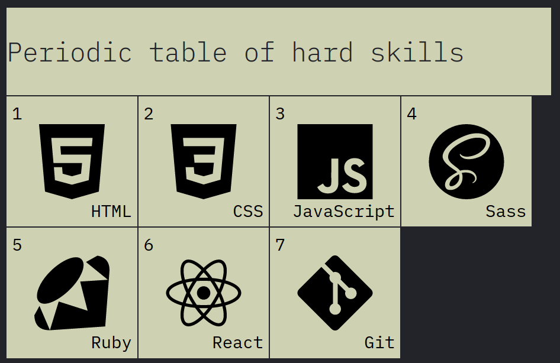

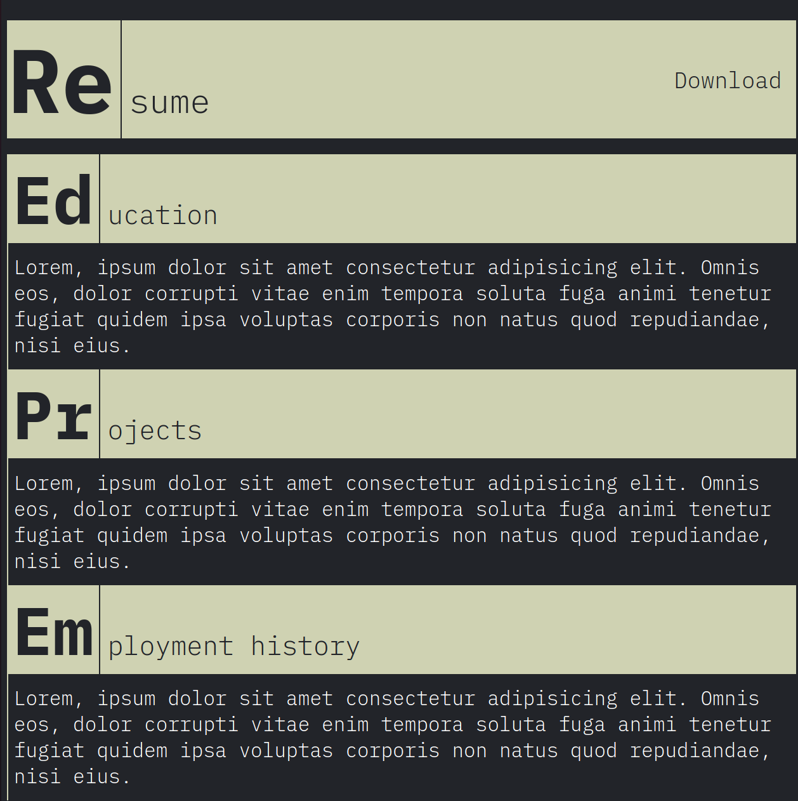

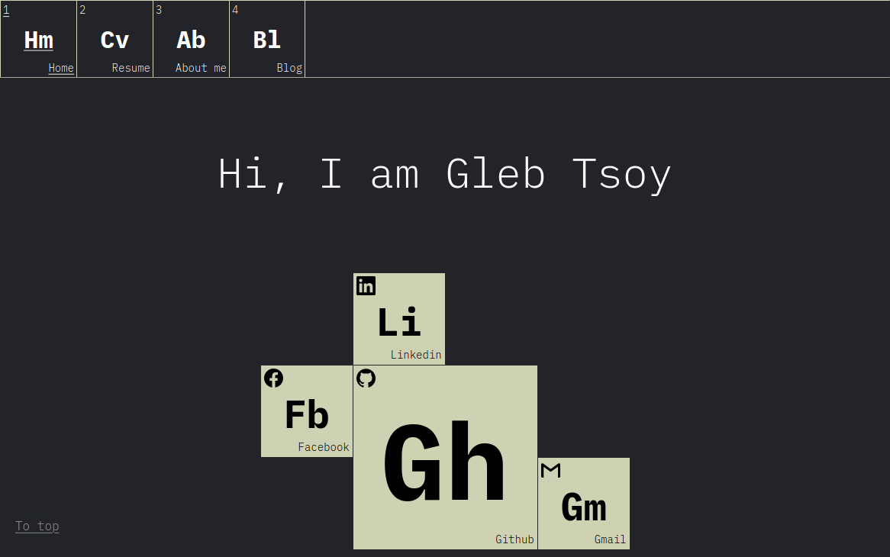

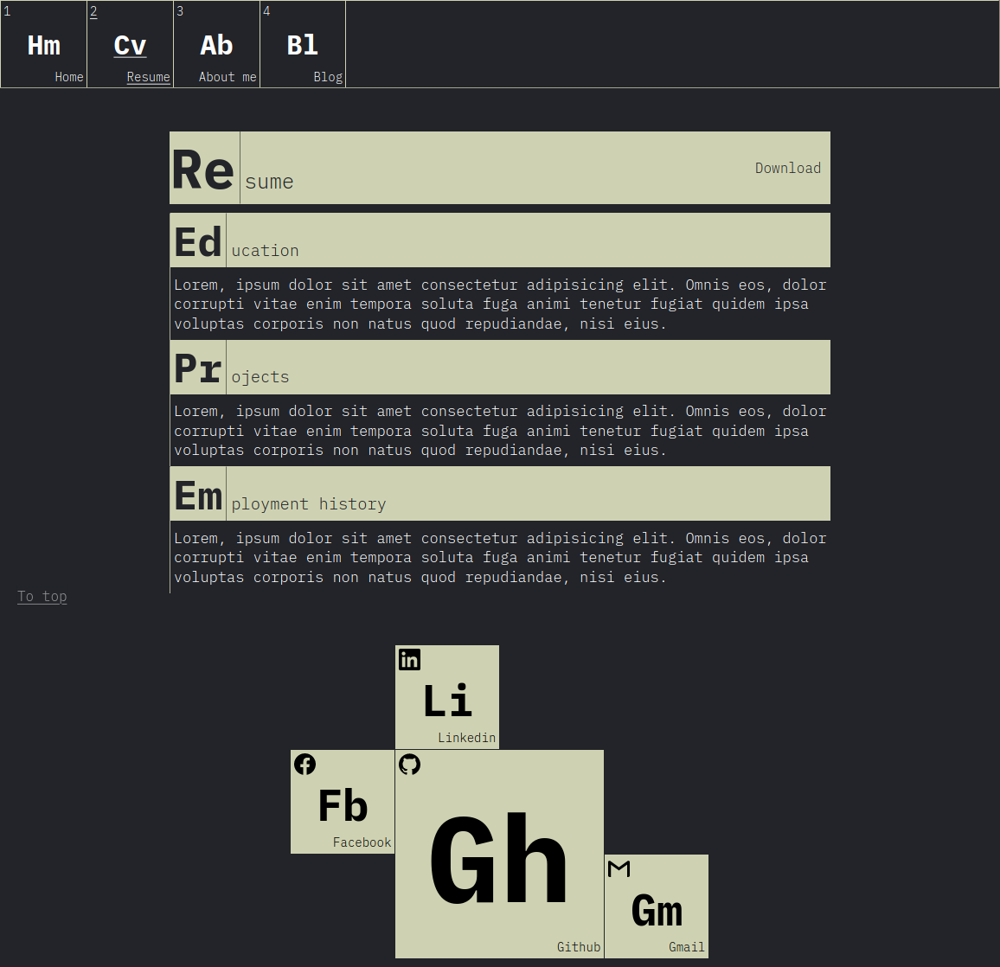

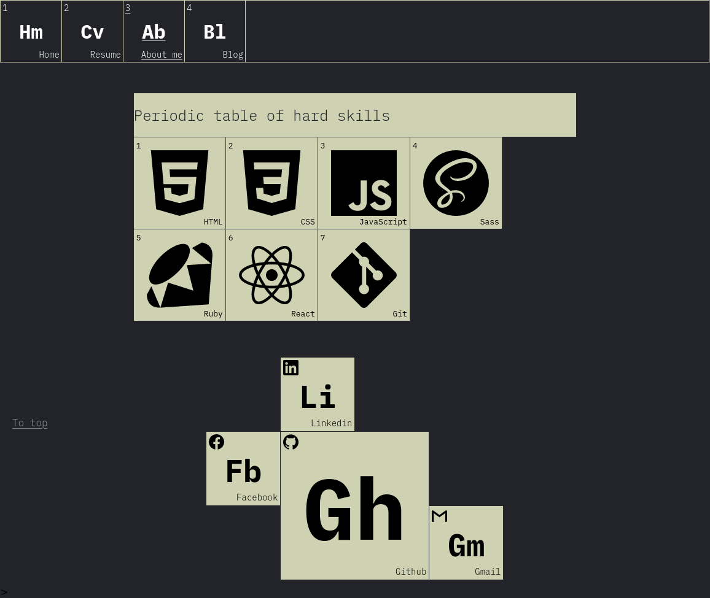

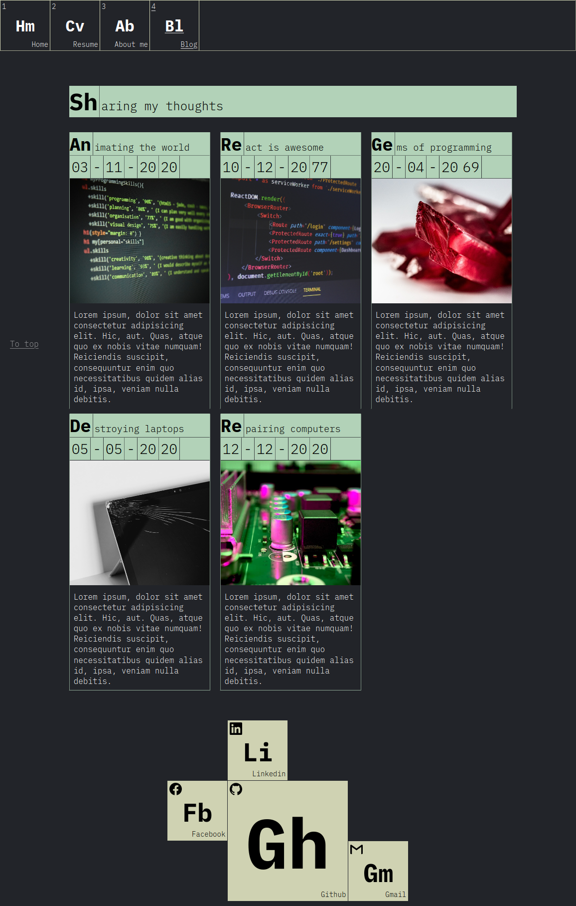

## Target audience

This website is intended for employers looking to hire a web developer.

## Tech stack

- HTML
- CSS
- Netlify
